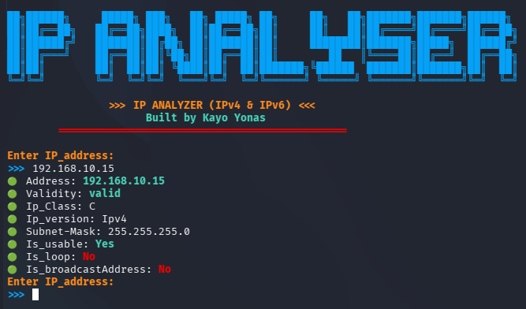

#  IP Analyzer Tool (C)

> Advanced IP Address Analysis Tool written in C
> Designed for networking learning, cybersecurity practice, and system-level programming.

---

##  Overview

**IP Analyzer** is a command-line tool that takes an IP address as input and performs deep analysis, including validation, classification, and network calculations.

This project demonstrates:

* Low-level string parsing
* Bitwise operations
* Structured programming in C
* Multi-file project architecture

---

##  Features

###  Core Analysis

* ✅ IPv4 validation
* ✅ IPv6 detection (basic)
* ✅ IP version identification
* ✅ Class detection (A, B, C, D, E)

###  Network Intelligence

* ✅ Public vs Private detection
* ✅ Loopback / Broadcast / Multicast detection
* ✅ Default subnet mask calculation
* ✅ Network address calculation
* ✅ Broadcast address calculation

###  System Design

* ✅ Modular multi-file architecture
* ✅ Custom structs for data handling
* ✅ Clean separation of logic and output

---

## Project Structure

```
ip-analyzer/
│
├── src/
│   ├── main.c
│   ├── analyzer.c
│   ├── ipv4.c
│   ├── ipv6.c
│   ├── utils.c
│
├── include/
│   ├── analyzer.h
│   ├── ipv4.h
│   ├── ipv6.h
│   ├── utils.h
│
|-- images/
|
├── Makefile
└── README.md
```

---

##  Installation & Compilation

###  Requirements

* GCC compiler
* Linux / macOS / Windows (with MinGW)

---

###  Compile

```bash
make
```

---

###  Run

```bash
./ip-analyzer
```

---

##  Example Usage

```
Enter IP Address: 192.168.10.15
```

###  Output



```

---

##  Limitations

* IPv6 validation is basic (not full standard)
* No CIDR support yet
* No CLI argument parsing (planned)  
* No binary representation

---

##  Learning Purpose

This project is built as part of a journey into:

* Cybersecurity & networking fundamentals
* Reverse engineering mindset
* Low-level system programming

---

##  Contributing

Contributions, suggestions, and improvements are welcome!

---

## Author

**Kayo yonas**

---

## ⭐ If you like this project

Give it a star and follow for more cybersecurity tools!
